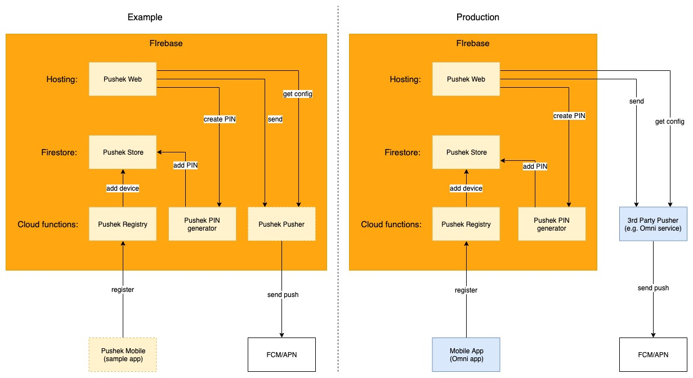

# Pushek

This is a push testing tool reducing the burden of understanding the technical side of push messaging. It is targeted for non-technical people. However, requires technical people to set it up.

## What problem are we trying to solve?

Our own app rely on push messages sent when content is created. Therefor, testing production push messages would require creating extra content or wait for one. So far the only people being able to test pushes were developers. We wanted to change that and allow our non-technical colleague to be able to test as well. 

We could make it just for our team but we decided on going open source so other teams can benefit and contribute to make this tool even better.

## Component design
Below drawings show relevant components in both scenarions. First one is an example that require minimum work:
- Create new Firebase project
- Setup authorisation in pusher and mobile apps
- Deploy on Firebase

It's a good start to play with the tool and test capabilities :nerd_face:

If you want to integrate this tool with your own backend and mobile apps, look at Production drawing.
It requires extra steps:
- In your backend system, provide two services. One for getting push config. Second for sending pushes. Go to [Setup](#backend) for more information

### Pushek Web
This is a web app that testers will interact with most of the time. It creates PINs that enable pairing with mobile devices. Next, lists all devices paired with previously generated PIN. Lastly, call associated pusher to send push messages.

### Pushek Store
This is a Firestore database where we store generated PINs and associated devices. The most relevant information of each device is token. Token identify device and app where pusher send messages.

### Pushek Registry
This is a cloud function responsible for registering mobile devices. It requires a PIN, token, system info and push type. In case iOS devices we support both APNS and FCM integrations.

PIN is manually entered by tester on mobile device. Our sample app shows a simple field to take the PIN but it's totally up to you how your app will take it e.g. could be a dialog shown on long press in the setting menu.

### Pushek PIN generator
This is cloud function generating PIN numbers used to pair with mobile devices. New PIN is generated for every web app session. It has expiration time set. See [functions](functions) for more details.

### Pushek Pusher
This is cloud function that talks to FCM and APN sending push messages. In production setup it can be replaced with 3rd party service.

### Pushek Mobile
This is a sample app representing both Android and iOS.

## Flow design

## Project structure

Root of this project was bootstrapped with [Create React App](https://github.com/facebook/create-react-app). 

### Cloud functions
Backend for this tool is written in `/functions` as Cloud Functions and deployed on Firebase.

### Mobile
Sample mobile apps for Android and iOS(TBD) are located in `/examples` folder.
For more details about Android sample go to [Android sample doc](examples/android/README.md)

## Setup

### Web app

TBD

### Backend

For detailed information about backend go to [functions](functions) readme.

### Mobile

Go to [Android sample doc](examples/android/README.md)
